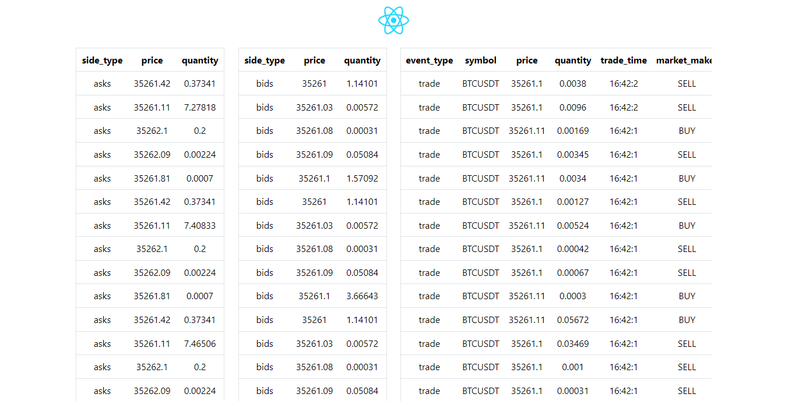

Binance orderbook + trades

## Працює на postgreSQL
Потребує розвернути базу її налаштування у файлі backend/.env

## Запуски

Фронт:

    cd frontend
    npm install
    npm run dev

Бек:

    cd backend
    pip install -r requirements
    uvicorn main:app --reload

Збір данних:

    python backend/utils/binance.py

## Результат:

